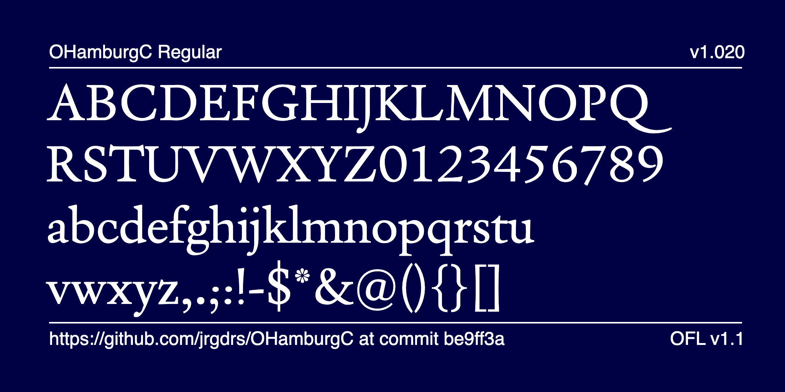
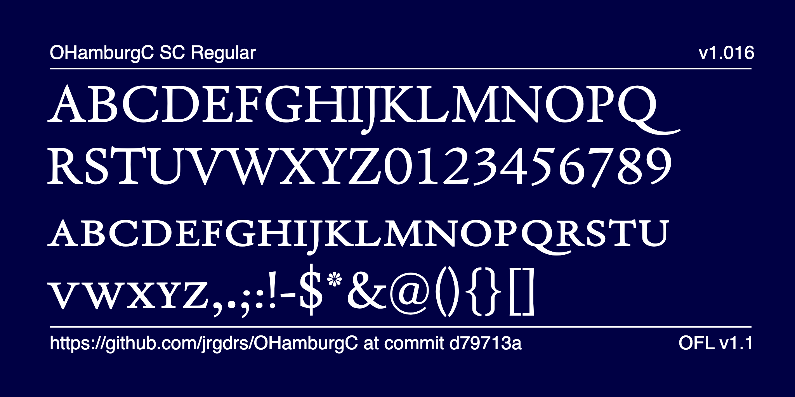
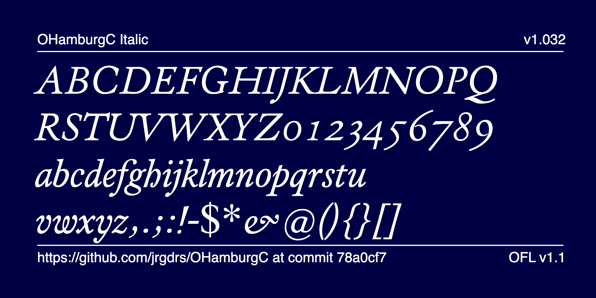
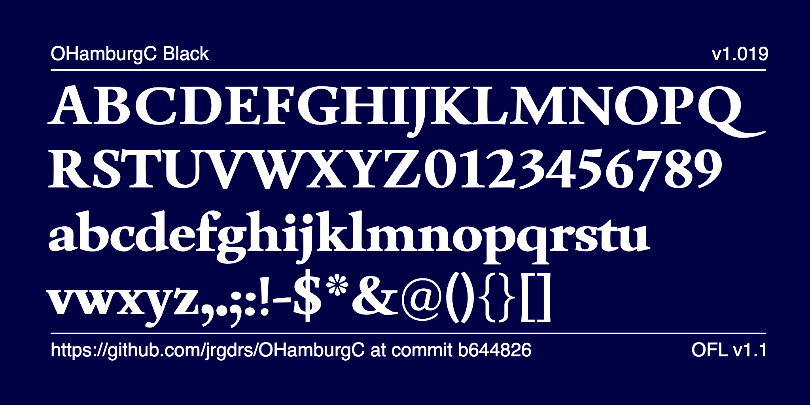

# OHamburgC

OHamburgC is a renaissance serif font created as of an exercise for an assignment of the Expert class Type design 2024-2025 at the Plantin Institute Antwerp. 

now also with small caps

and with italic

today also in first black

## Specimen

Please find Specimen and Samples in the subfolder /documentation

## Status

Work in progress.

## Contribution

To contribute, see <a href="https://github.com/jrgdrs/OHamburgC">github.com/jrgdrs/OHamburgC</a>.
Or send me your response as a github issue ticket https://github.com/jrgdrs/OHamburgC/issues
