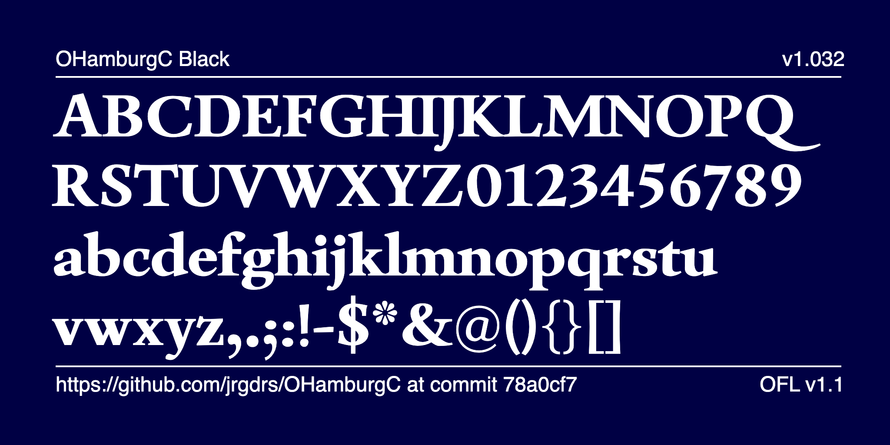

# OHamburgC

OHamburgC is a renaissance serif font created as of an exercise for an assignment of the Expert class Type design 2024-2025 at the Plantin Institute Antwerp. 

now also with small caps

and italic

also with black cut

The current version contains a version condensed by exactly one unit of the cadence and an extended version by exactly one unit on the variable wdth axis 80-120

Also a new testbed for justification checks

<a href="https://jrgdrs.github.io/OHamburgC/index_v5.html">Check different justificationo methods</a>

## Specimen

Please find Specimen and Samples in the subfolder /documentation

## Status

Work in progress.

## Contribution

To contribute, see <a href="https://github.com/jrgdrs/OHamburgC">github.com/jrgdrs/OHamburgC</a>.
Or send me your response as a github issue ticket https://github.com/jrgdrs/OHamburgC/issues
